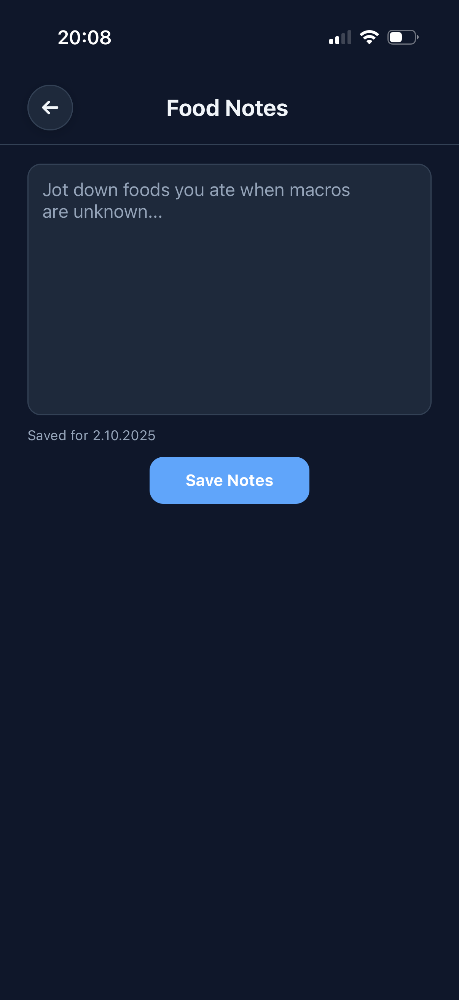
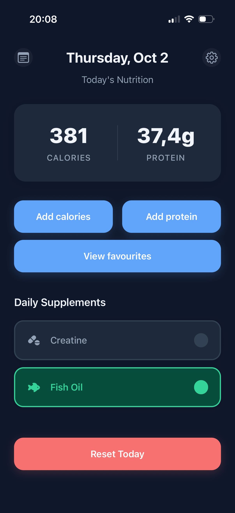
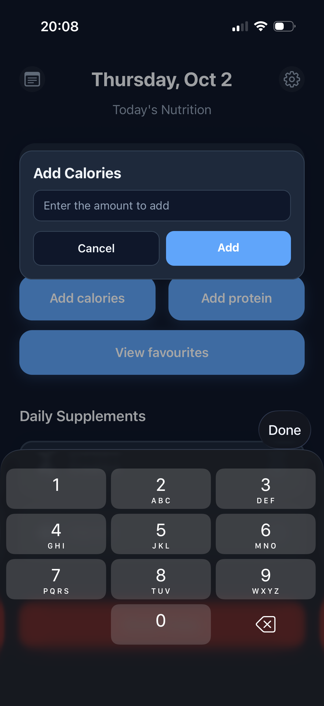
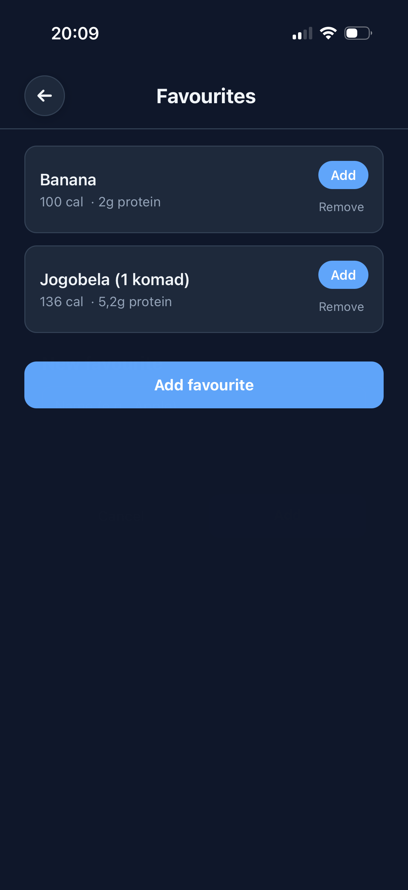
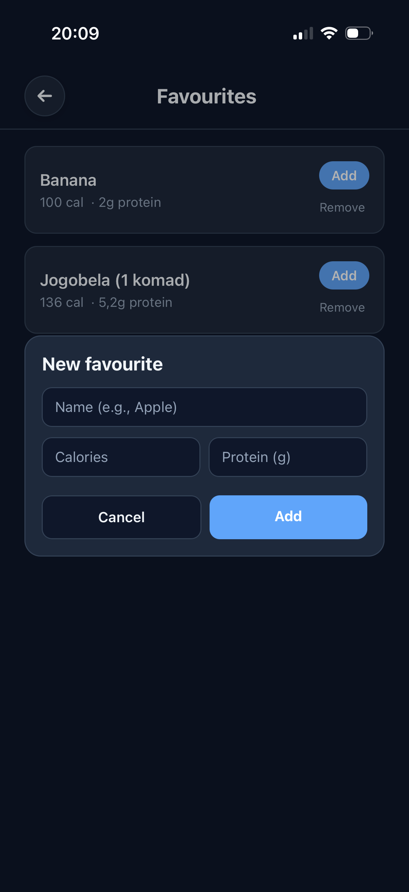
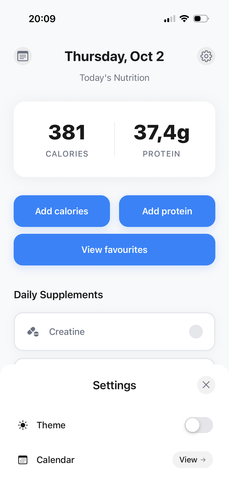
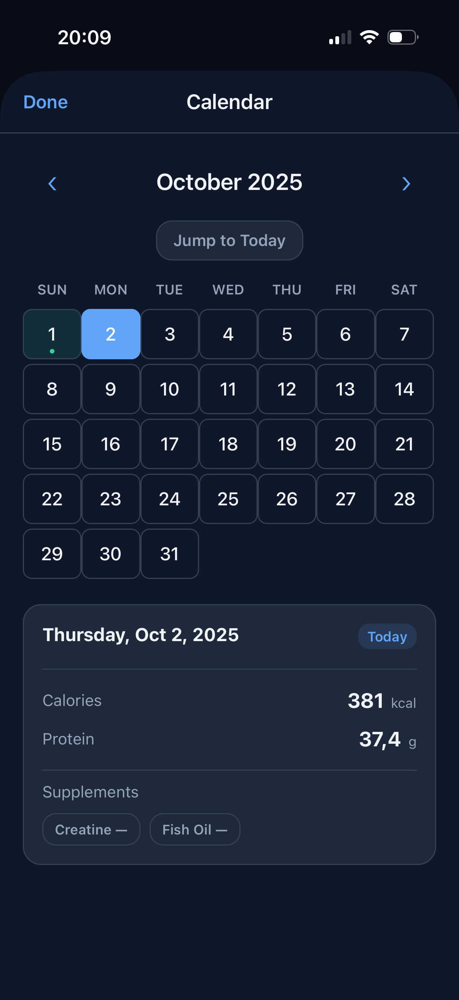
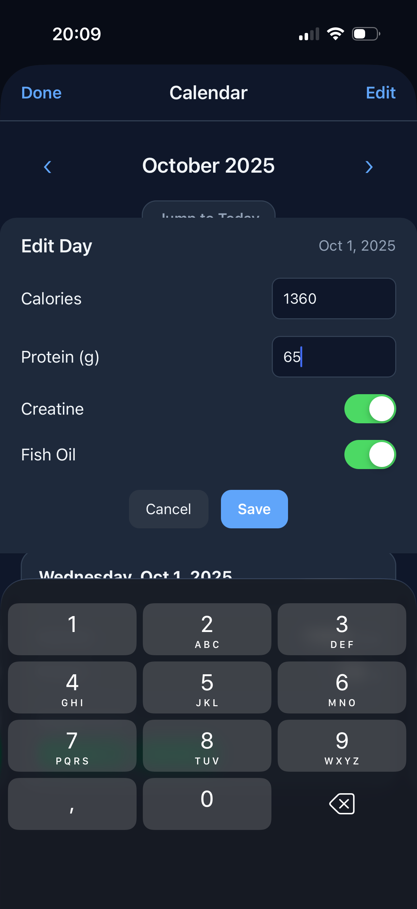

# Macro Tracker App

A modern React Native mobile app for tracking daily nutrition intake with an intuitive interface and calendar functionality.

## ✨ Features

## 📸 Screenshots










## 🚀 Testing

**📱 You need the Expo Go app to test**
Download Expo Go from your app store:

- [iOS App Store](https://apps.apple.com/app/expo-go/id982107779)
- [Google Play Store](https://play.google.com/store/apps/details?id=host.exp.exponent)

Then open this link on your phone:
👉 [**Test the Food Tracker App**](https://expo.dev/preview/update?message=feat%3A+enhance+CalendarModal+with+editing+capabilities+for+nutrition+data+and+add+animated+transitions&updateRuntimeVersion=1.0.0&createdAt=2025-09-29T20%3A17%3A25.193Z&slug=exp&projectId=ab8d3372-dd8a-47d3-91e9-1992af123d60&group=f25344f0-e879-471d-b950-d1704d01968b)

## 🛠️ Local Development

### Prerequisites

- Node.js (v16 or higher)
- npm or yarn
- Expo CLI

### Installation

1. Clone the repository:

   ```bash
   git clone <repository-url>
   cd food-tracker-app
   ```

2. Install dependencies:

   ```bash
   npm install
   ```

3. Start the development server:

   ```bash
   npm start
   ```

4. Run on your preferred platform:
   - **Expo Go**: Scan the QR code with Expo Go app
   - **Android**: `npm run android`
   - **iOS**: `npm run ios`
   - **Web**: `npm run web`

## 📖 How to Use

1. **🍽️ Adding Food**: Tap the green "+" button and enter calories and protein values
2. **📊 View Totals**: Current daily totals are displayed in nutrition cards
3. **📅 Calendar**: Access the calendar to view/edit data from different dates
4. **💊 Supplements**: Track your daily supplements in the dedicated section
5. **⚙️ Settings**: Customize themes and app preferences

## 🏗️ Project Structure

```text
food-tracker-app/
├── src/
│ ├── components/ # Reusable UI components
│ │ ├── calendar/ # Calendar modal components
│ │ └── ui/ # UI elements (buttons, cards, etc.)
│ ├── context/ # React context providers
│ ├── hooks/ # Custom React hooks
│ ├── styles/ # Styling modules
│ └── utils/ # Utility functions
├── assets/ # Images and static assets
├── App.js # Main app component
├── app.json # Expo configuration
└── package.json # Dependencies and scripts
```

## 🚀 Contributing

Contributions are welcome.
